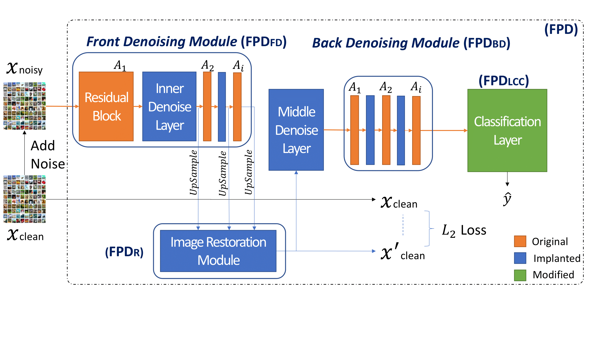
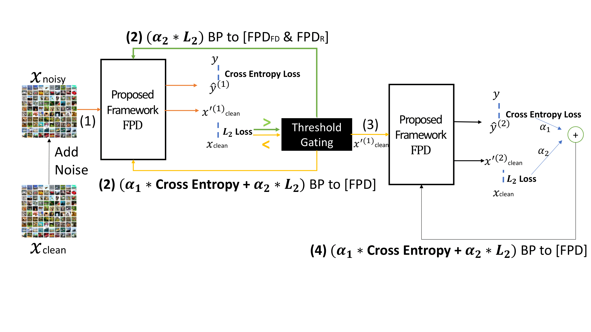

# Enhancing Intrinsic Adversarial Robustness via Feature Pyramid Decoder

This repo contains the code and data of the following paper:
>**Enhancing Intrinsic Adversarial Robustness via Feature Pyramid Decoder**, *Guanlin Li, Shuya Ding, Jun Luo, Chang Liu*, CVPR2020

# Overview
<p align="center"></p> 
We propose an attack-agnostic defence framework to enhance the intrinsic robustness of neural networks, without jeopardizing the ability of generalizing clean samples. Our Feature Pyramid Decoder (FPD) framework applies to all block-based convolutional neural networks (CNNs). It implants denoising and image restoration modules into a targeted CNN, and it also constraints the Lipschitz constant of the classification layer.

# Training Strategy
<p align="center"></p>
Implementation details of two-phase training strategy utilizing self-supervised and multi-task learning: the enhanced CNN FPD, in which FPD_R refers to the image restoration module; FPD_FD stands for the front denoising module; FPD_BD stands for the back denoising module; FPD_LCC refers to the modified classification layer; x_noisy are the samples in the ε-neighbourhood of each image. The first phase training is optimized by L_2(x_clean,x_clean') loss. If L_2 loss >T, only the parameters of FPD_R and FPD_FD is updated. Once the L_2 loss reaches the T, the cross-entropy (CE) loss with L_2 loss jointly trains the enhanced CNN. Then, the second phase train the enhanced CNN further, jointly optimized by CE loss and L_2 loss.

# Dataset
- The MNIST and SVHN can be downloaded by *torchvision.datasets* 
- The CALTECH-101 and CALTECH-256 can be downloaded from [here](http://www.vision.caltech.edu/Image_Datasets/Caltech101/) and [here](http://www.vision.caltech.edu/Image_Datasets/Caltech256/), respectively.

# Prerequisites
- Python 3.6
- Numpy
- Pytorch >=1.0.0
- torchvision
- tqdm
- [adversarial-robustness-toolbox](https://github.com/IBM/adversarial-robustness-toolbox)
- [Adversarial Box](https://github.com/wanglouis49/pytorch-adversarial_box)

# Pre-trained Models

We upload all models we trained. You can download them freely from [here](https://drive.google.com/drive/folders/1-iNlznRof1XS7taV4xx9tN6reNQXm-yX?usp=sharing).

# Usage
- `early_stop.py`: Early stop to avoid overfitting.
- `resnet.py`: In every folder, we upload the enhanced network based on different backbone models.
- `train.py`: Two-phase training strategy to train our enhanced models.
- `adv_train.py`: To have better results, we introduce adversarial training after two-phase training.
- `models.py`: For black-box attack, using as the attacking reference.
- `whitebox_and_black.py`: Attack models via various methods on different datasets.

# Citing

If you find it useful for your research, please consider citing the following reference paper:

```
@inproceedings{li2020enhancing,
  author    = {Guanlin Li and
               Shuya Ding and
               Jun Luo and
               Chang Liu},
  title     = {Enhancing Intrinsic Adversarial Robustness via Feature Pyramid Decoder},
  booktitle = {Computer Vision and Pattern Recognition (CVPR)},
  year      = {2020}
}
```
